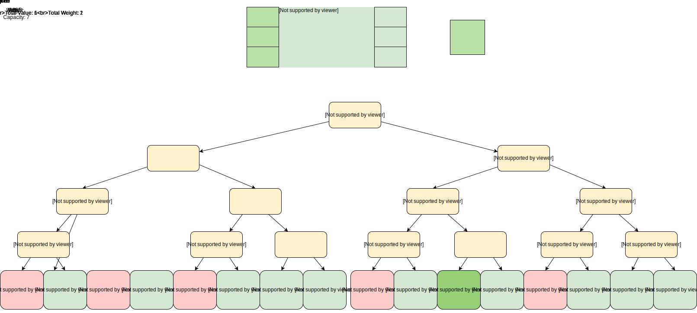

# Presentation

---

- Bruteforce algorithm

  - Time complexity is exponential: **O(2^N)**.
    The number of combinations is 2^N which N is the number of stocks.

  - Space complexity is linear: **O(N)**.
    Memory is allocated for each recursion needed to compute a combination.

---

<style>
  .container { display: flex; }
  .col { flex: 1;}
</style>
<div class="container">
  <div class="col">

|     | A   | B   |
| --- | --- | --- |
| 1   | 0   | 0   |
| 2   | 0   | 1   |
| 3   | 1   | 0   |
| 4   | 1   | 1   |

  </div>
  <div class="col">

|     | A   | B   | C   |
| --- | --- | --- | --- |
| 1   | 0   | 0   | 0   |
| 2   | 0   | 0   | 1   |
| 3   | 0   | 1   | 0   |
| 4   | 0   | 1   | 1   |
| 5   | 1   | 0   | 0   |
| 6   | 1   | 0   | 1   |
| 7   | 1   | 1   | 0   |
| 8   | 1   | 1   | 1   |

  </div>
  <div class="col">

| N   | 2^N     |
| --- | ------- |
| 0   | 1       |
| 1   | 2       |
| 2   | 4       |
| 3   | 8       |
| 4   | 16      |
| 18  | 262144  |
| 19  | 524288  |
| 20  | 1048576 |

  </div>
</div>

---

- Bruteforce visual representation



---

```python
def bruteforce(value, stocks, picked=[]):
    if stocks:
        # recursively call bruteforce and start to evaluate possibilities from the last item in stocks
        # 1st possibility: skip the stock
        x, combi1 = bruteforce(value, stocks[1:], picked)

        pick = stocks[0]
        if pick[1] <= value:
            # second possibility: pick the stock
            # update new value
            y, combi2 = bruteforce(value - pick[1], stocks[1:], picked + [pick])

            # return the combination with the best profit
            if x < y:
                return y, combi2
        return x, combi1
    else:
        return sum(i[2] for i in picked), picked

```

---

- Optimized algorithm

  - Time complexity is: **O(m \* N)**.
    The numbers of subproblems which m represents every possible value (or capacity) and N the number of items.

  - Space complexity is: **O((m+1) \* (N+1))**.
    The size of the matrix containing each subproblems.

Avoid redundant events by breaking them in subproblems so don't need to calculate all the possibilities.
Start from the simpliest to the most complex event.
Each computation is incremental.

---

- Optimized algorithm visual representation

|      | Price | Profit | 0   | 1   | 2   | 3   | 4   | 5   |
| ---- | ----- | ------ | --- | --- | --- | --- | --- | --- |
| None |       |        | 0   | 0   | 0   | 0   | 0   | 0   |
| A    | 4     | 12     | 0   | 0   | 0   | 0   | 12  | 12  |
| B    | 3     | 10     | 0   | 0   | 0   | 10  | 12  | 12  |
| C    | 2     | 6      | 0   | 0   | 6   | 10  | 12  | 16  |

---

```python
def optimized(value, stocks):
    # Build a matrix of possible solutions
    value = trunc(value)
    m = [[0 for column in range(value + 1)] for line in range(len(stocks) + 1)]

    # Start from index 1 because no solutions in first line and first column (fill with 0's)
    # Iterate for each stock
    for ln in range(1, len(stocks) + 1):
        # Iterate for each possible value
        for col in range(1, value + 1):
            # if stock price is less or equals to actual value, pick it
            # otherwise skip it, optimized profits is same as previous stock
            if stocks[ln - 1][1] <= col:
                # compare optimized profits of actual value for previous stock with
                # (stock profit + optimized profits for previous stock of [value = actual value - stock value])
                m[ln][col] = max(stocks[ln - 1][2] + m[ln - 1][col - trunc(stocks[ln - 1][1])], m[ln - 1][col])
            else:
                m[ln][col] = m[ln - 1][col]

    v = value
    n = len(stocks)
    picked = []

    # Retrieve picked stocks from the last stock in the matrix until value is zero
    while v >= 0 and n >= 0:
        p = stocks[n - 1]
        # Optimized profit is equals to stock profit + optimized profits for previous stock of [value = actual value - stock value]
        if m[n][trunc(v)] == m[n - 1][trunc(v - p[1])] + p[2]:
            picked.append(p)
            v -= p[1]
        n -= 1
    return m[-1][-1], picked

```

---

- Bruteforce vs. Optimized ?

| For m = 20 | Bruteforce | Optimized |
| ---------- | ---------- | --------- |
| N          | 2^N        | m\*N      |
| 3          | 8          | 60        |
| 4          | 16         | 80        |
| 6          | 64         | 120       |
| 7          | 128        | 140       |
| 8          | 256        | 160       |
| 20         | 1048576    | 400       |

---

<div class="container">
  <div class="col">

0. Number of stocks: 20

```
   Name     Price €   Profit €
Action-20    114.0    20.52
Action-6      80.0    20.00
Action-4      70.0    14.00
Action-5      60.0    10.20
Action-11     42.0    7.14
Action-13     38.0    8.74
Action-10     34.0    9.18
Action-8      26.0    2.86
Action-19     24.0    5.04
Action-18     10.0    1.40
Portfolio value: 498.00 €
Return profits: 99.08 €
```

  </div>
</div>

---

<div class="container">
  <div class="col">
1. Number of stocks: 957

```
   Name     Price €   Profit €
Share-GHIZ    28.0    11.17
Share-LSZT    34.9    13.68
Share-DBMG   37.07    14.13
Share-LPDM   39.35    15.63
Share-LOKP   41.04    16.08
Share-FYKQ   41.06    15.91
Share-JHLP   42.97    15.95
Share-TEET    43.2    16.39
Share-YRSC    47.0    18.00
Share-XKAM   47.01    17.91
Share-EKHU   47.13    16.51
Share-AOLT   48.53    17.68
Portfolio value: 497.26 €
Return profits: 204.53 €
```

  </div>
  <div class="col">

```
Sienna bought:

Share-GRUT

Total cost: 498.76€
Total return: 196.61€
```

  </div>
</div>

---

<div class="container">
  <div class="col">
2. Number of stocks: 541

```
   Name     Price €   Profit €
Share-NDKR   33.06    13.19
Share-PSMF   33.45    13.00
Share-JGTW   35.29    13.91
Share-SFQC   36.53    14.22
Share-ENZZ   37.24    14.22
Share-YRAH   37.34    12.33
Share-OPBR    39.0    15.19
Share-VWZM   40.41    14.63
Share-DFGJ   40.44    13.22
Share-JWGF   48.69    19.44
Share-QEVK   49.77    17.11
Share-MBQU   51.46    18.41
Portfolio value: 482.68 €
Return profits: 202.12 €
```

  </div>
  <div class="col">

```
Sienna bought:
Share-ECAQ 3166
Share-IXCI 2632
Share-FWBE 1830
Share-ZOFA 2532
Share-PLLK 1994
Share-YFVZ 2255
Share-ANFX 3854
Share-PATS 2770
Share-NDKR 3306
Share-ALIY 2908
Share-JWGF 4869
Share-JGTW 3529
Share-FAPS 3257
Share-VCAX 2742
Share-LFXB 1483
Share-DWSK 2949
Share-XQII 1342
Share-ROOM 1506

Total cost: 489.24€
Profit: 193.78€
```

  </div>
</div>

---

# End
